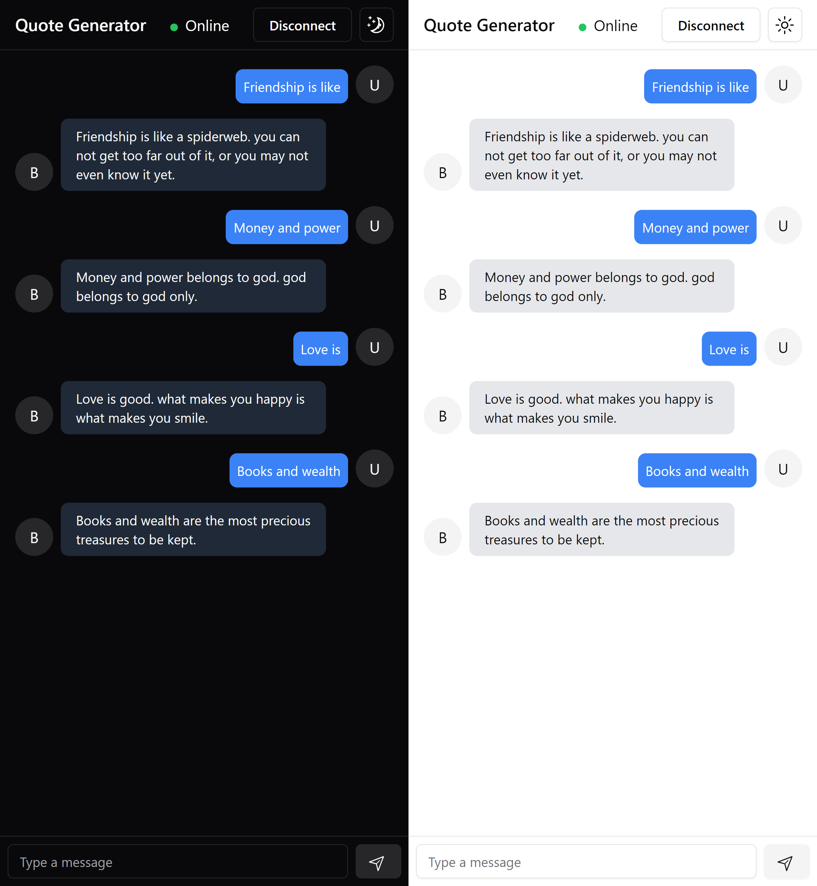

# Quotes Generator with AI

<picture>
  <source media="(prefers-color-scheme: dark)" srcset="./imgs/chat-ui-mobile.jpg">
  
</picture>

This repository contains

- [chat-server](./chat-server/README.md)
- [chat-client](./chat-client/README.md)

## Environment Variables

To run this project, you will need to add `.env` files to your [chat-client](./chat-client/README.md) and [chat-server](./chat-server/README.md) projects.

`VITE_SOCKET_URL` - The URL to connect to backend services

`HF_TOKEN` - The huggingface token

`LLM_MODEL` - The LLM model that you want use to generate quotes.

## Build for Production

```bash
  docker build . -t "chat-app:1.0"
```

## Run the application

```bash
  docker run -p 3132:3132 chat-app:1.0
```

and go to [`http://localhost:3132/messages`](http://localhost:3132/messages)

## Author

- [@mink](https://www.github.com/mink-a)

## License

[MIT](https://choosealicense.com/licenses/mit/)
